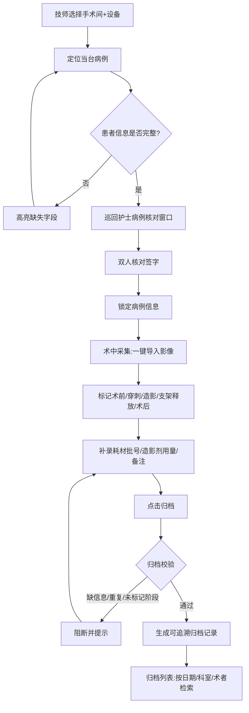

# 术中影像归档工具 PRD

## 1. 产品概述

面向介入手术室技师与巡回护士的桌面端术中影像归档工具，解决 DSA、超声、内镜截图与透视片段术后散落在不同设备、反复拷贝改名找病例的痛点。通过"术中采集—病例核对—归档列表"三窗一体化流程，实现一键导入、阶段标记、双人核对与可追溯归档，把手术结束后的整理时间从分钟级压缩到一键级。

- 目标用户：介入手术室技师（主操作者）、巡回护士（核对者）
- 核心价值：减少术后反复拷贝/改名/找病例的时间，保证影像资料可追溯、阶段完整、患者信息准确
- 部署形态：本地优先的桌面应用（Web 技术构建，可后续封装为 Electron/Tauri）

## 2. 核心功能

### 2.1 用户角色

| 角色 | 进入方式 | 核心权限 |
|------|---------------------|------------------|
| 介入手术室技师 | 工号登录（本演示以默认工号进入） | 选择病例、导入影像、标记阶段、补录耗材/造影剂、触发归档、检索归档列表 |
| 巡回护士 | 工号登录（本演示以默认工号进入） | 患者信息双人核对确认、补充备注、查阅归档列表 |

### 2.2 功能模块（三窗口）

1. **术中采集窗口**：手术间/设备/病例快速选择、患者信息卡、双人核对状态、影像一键导入、阶段标记、耗材与造影剂补录、归档前校验、触发归档
2. **病例核对窗口**：按手术间+设备定位当台病例、患者信息大字展示、双人核对签字、核对锁定
3. **归档列表窗口**：按日期/科室/术者检索已归档资料、归档记录详情、追溯码、阶段完整性回看

### 2.3 页面详情

| 窗口 | 模块 | 功能描述 |
|------|------|----------|
| 术中采集 | 术间选择器 | 手术间下拉 + 设备类型（DSA/超声/内镜/透视）联动，定位当台病例 |
| 术中采集 | 患者信息卡 | 姓名、住院号、手术名称、术者、开始时间；缺失字段高亮提示 |
| 术中采集 | 双人核对状态 | 技师确认 + 护士确认两枚状态徽章，未完成置灰，完成亮绿 |
| 术中采集 | 影像导入区 | 拖拽/点击导入图像、短视频、造影序列；自动生成缩略图与元数据 |
| 术中采集 | 资产列表与阶段标记 | 每条资产可标记：术前/穿刺/造影/支架释放/术后复查；支持批量标记 |
| 术中采集 | 耗材与造影剂补录 | 耗材名称+批号+数量；造影剂名称+用量(mL)+浓度；关键备注 |
| 术中采集 | 归档校验面板 | 实时检测：缺患者信息/重复病例/未标记阶段，清单式列出阻断项 |
| 术中采集 | 归档动作 | 通过校验后生成可追溯归档记录（含追溯码、时间戳、操作人） |
| 病例核对 | 病例定位 | 手术间 + 设备快速定位当台待核对病例 |
| 病例核对 | 大字信息板 | 患者姓名、住院号、手术名称、术者、开始时间大字显示，便于远处核对 |
| 病例核对 | 双人签字 | 技师工号 + 护士工号两路确认，确认后锁定该病例信息不可随意改 |
| 归档列表 | 检索栏 | 日期范围、科室、术者三个维度组合检索 |
| 归档列表 | 归档记录表 | 追溯码、患者、手术、术者、归档时间、资产数、阶段完整度 |
| 归档列表 | 记录详情抽屉 | 展开查看该病例全部资产、阶段分布、耗材/造影剂/备注 |

## 3. 核心流程

主流程：技师在"术中采集"按手术间+设备选择当台病例 → 系统拉取患者信息 → 巡回护士在"病例核对"完成双人核对并锁定 → 技师一键导入术中影像并标记阶段 → 补录耗材批号/造影剂用量/备注 → 点击归档触发校验（缺信息/重复/未标记阶段则阻断并提示）→ 通过后生成带追溯码的归档记录 → 术后在"归档列表"按日期/科室/术者检索调阅。

## 4. 用户界面设计

### 4.1 设计风格

- **风格定位**：临床技术感 / 医学影像级精确（Clinical Technical Precision）。深色环境契合介入手术室暗光场景，像 DICOM 影像查看器一样让图像资料本身成为视觉主角；信息密度高但网格严格对齐，体现"务实、可信赖、无多余装饰"。
- **主色**：背景深石墨 `#0E1116` / 面板 `#161B22`；主强调色为临床青 `#2DD4BF`（医疗器械冷光感）；辅以"消毒蓝" `#38BDF8` 作次级强调
- **状态色**：完整/通过 `#10B981`（绿）；待处理/警告 `#F59E0B`（琥珀）；缺失/阻断 `#EF4444`（红）；中性灰 `#6B7280`
- **按钮风格**：直角微圆角（4px），主操作实色填充 + 内发光，次操作描边，危险操作红描边；按钮带左侧状态点
- **字体**：标题与正文用 IBM Plex Sans（机构/工程/临床气质），数据/编号/批号/追溯码用 IBM Plex Mono；数字字段 tabular-nums 对齐
- **布局**：左侧固定导航栏切换三窗口，主区严格 12 列网格；卡片用 1px 描边 + 极弱发光分层，避免重阴影
- **图标/emoji**：线性图标（手术间、设备、阶段、核对、归档），阶段用色块徽章；不用装饰性 emoji

### 4.2 页面设计概览

| 窗口 | 模块 | UI 元素 |
|------|------|---------|
| 术中采集 | 术间选择器 | 顶部 segmented 手术间切换 + 设备类型标签组，当前选中高亮青色 |
| 术中采集 | 患者信息卡 | 5 字段网格，缺失字段红字虚线框 + "补录"小按钮 |
| 术中采集 | 双人核对徽章 | 两枚圆形徽章，未完灰色叉/完绿勾，hover 显示操作人工号 |
| 术中采集 | 影像导入区 | 大面积虚线拖放区 + "导入图像/视频/造影序列"分段按钮，拖入有缩略图浮现动画 |
| 术中采集 | 资产列表 | 表格行：缩略图 + 文件名(mono) + 类型徽章 + 阶段下拉 + 时长/尺寸，行 hover 高亮 |
| 术中采集 | 耗材造影剂补录 | 双栏卡片：耗材表格可增行 + 造影剂输入组 + 备注多行文本 |
| 术中采集 | 归档校验面板 | 右侧 sticky 面板，清单项前状态点（红阻断/绿通过），底部"生成归档记录"主按钮 |
| 病例核对 | 大字信息板 | 居中超大字姓名/住院号，左手术信息右时间，底部双签字区 |
| 病例核对 | 双人签字 | 两个工号输入 + 确认按钮，确认后出现锁定锁图标 |
| 归档列表 | 检索栏 | 日期范围选择器 + 科室下拉 + 术者下拉 + 关键字输入，结果数实时计数 |
| 归档列表 | 归档记录表 | 表格：追溯码(mono,青色可点) + 患者 + 手术 + 术者 + 归档时间 + 资产数徽章 + 阶段完整度进度条 |
| 归档列表 | 记录详情抽屉 | 右侧滑出抽屉，分页签展示资产网格/阶段分布/耗材造影剂/核对与操作日志 |

### 4.3 响应式

桌面优先（目标为手术室工作站/触屏一体机），最小宽度 1280px 适配；关键操作按钮与拖放区在触屏下放大命中区域；归档列表表格在窄屏横向滚动而非折叠。

### 4.4 3D 场景

本项目无 3D 场景需求。
