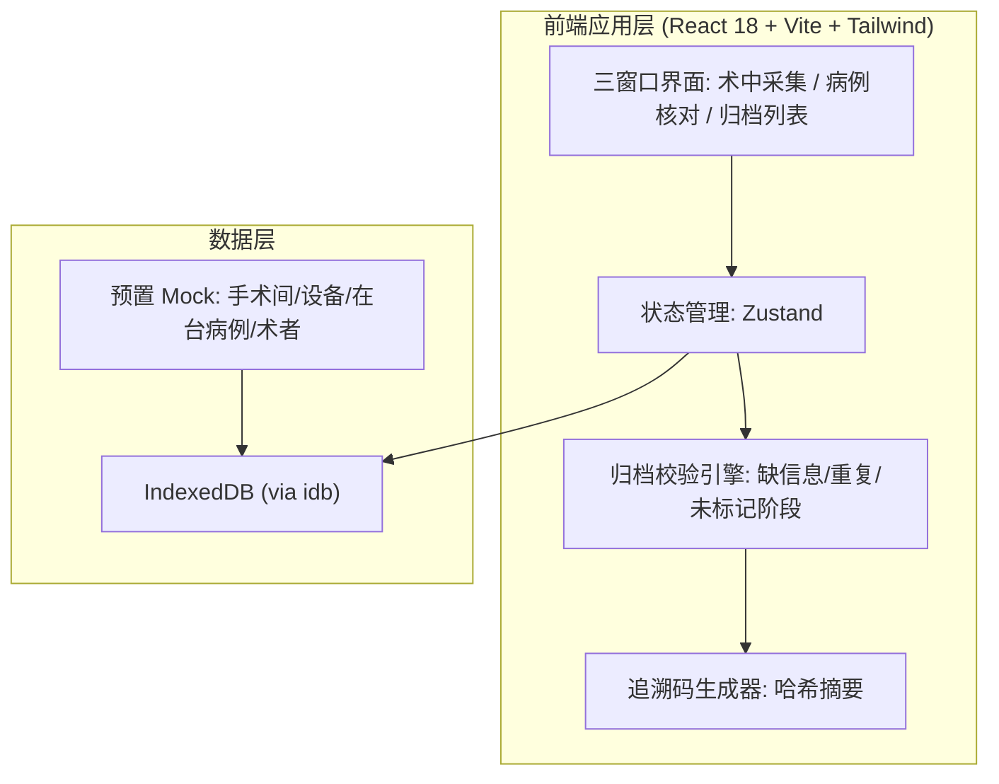

# 术中影像归档工具 技术架构文档

## 1. 架构设计

桌面端本地优先应用，纯前端实现（Web 技术栈），数据持久化于浏览器 IndexedDB，无后端服务，便于后续以 Electron/Tauri 打包为原生桌面应用。



## 2. 技术说明

- **前端**：React@18 + tailwindcss@3 + vite
- **初始化工具**：vite-init（`npm create vite@latest`）
- **状态管理**：Zustand（轻量，适合本地状态与跨窗口共享）
- **持久化**：IndexedDB，封装库 `idb`（存储影像资产 Blob 与归档记录）；少量配置走 localStorage
- **图标**：lucide-react（线性图标，契合临床技术风格）
- **字体**：IBM Plex Sans / IBM Plex Mono（通过 `@fontsource` 引入）
- **后端**：无（本地优先，可后续扩展）
- **数据库**：无外部数据库，使用浏览器 IndexedDB；含可重置的 Mock 种子数据

## 3. 路由定义

应用为单页三窗口，通过左侧导航在三个主视图间切换（基于内部状态切换，非 URL 路由亦可；此处给出对应路径概念）：

| 路径概念 | 用途 |
|-------|---------|
| /collect | 术中采集窗口：术间/设备/病例选择、影像导入、阶段标记、补录、归档 |
| /verify | 病例核对窗口：双人核对与锁定 |
| /archive | 归档列表窗口：检索已归档资料与详情 |

## 4. API 定义

无后端 API。数据访问通过 Zustand store + IndexedDB 封装的仓库层完成，对外暴露以下方法签名：

```ts
// 病例仓库
getActiveCases(roomId: string, deviceType: DeviceType): Promise<Case[]>
getCase(caseId: string): Promise<Case>
updateCase(caseId: string, patch: Partial<Case>): Promise<void>
lockCase(caseId: string, verifier: Verifier): Promise<void>

// 影像资产仓库
importAsset(caseId: string, file: File, meta: AssetMeta): Promise<Asset>
listAssets(caseId: string): Promise<Asset[]>
setAssetStage(assetId: string, stage: Stage): Promise<void>

// 耗材/造影剂/备注
addConsumable(caseId: string, c: Consumable): Promise<void>
setContrast(caseId: string, c: ContrastAgent): Promise<void>
addRemark(caseId: string, r: Remark): Promise<void>

// 归档
runArchiveValidation(caseId: string): Promise<ValidationResult>
createArchiveRecord(caseId: string): Promise<ArchiveRecord>
searchArchives(query: ArchiveQuery): Promise<ArchiveRecord[]>
```

## 5. 服务端架构

无服务端。

## 6. 数据模型

### 6.1 数据模型定义

```mermaid
erDiagram
    CASE ||--o{ ASSET : "包含"
    CASE ||--o{ CONSUMABLE : "使用"
    CASE ||--o{ REMARK : "记录"
    CASE ||--|| CONTRAST_AGENT : "使用"
    CASE ||--|| VERIFICATION : "双人核对"
    CASE ||--o| ARCHIVE_RECORD : "归档为"
    CASE }o--|| ROOM : "位于"
    CASE }o--|| DEVICE : "使用"
    CASE }o--|| SURGEON : "由"

    CASE {
        string caseId PK
        string patientName
        string hospitalizationNo
        string surgeryName
        string surgeonId FK
        string department
        string roomId FK
        string deviceType
        string startTime
    }
    ASSET {
        string assetId PK
        string caseId FK
        enum type
        enum stage
        string filename
        number sizeBytes
        number durationMs
        string importedAt
    }
    CONSUMABLE {
        string consumableId PK
        string caseId FK
        string name
        string batchNo
        number quantity
    }
    CONTRAST_AGENT {
        string caseId PK_FK
        string name
        number dosageMl
        string concentration
    }
    REMARK {
        string remarkId PK
        string caseId FK
        string content
        string author
        string timestamp
    }
    VERIFICATION {
        string caseId PK_FK
        string technicianId
        string nurseId
        string technicianAt
        string nurseAt
        boolean locked
    }
    ARCHIVE_RECORD {
        string recordId PK
        string caseId FK
        string traceCode
        string archivedAt
        string archivedBy
        number assetCount
        string stageCoverage
    }
```

### 6.2 数据定义语言

以 TypeScript 类型与 IndexedDB objectStore 形式定义（无 SQL）：

```ts
type DeviceType = 'DSA' | '超声' | '内镜' | '透视';
type Stage = '术前' | '穿刺' | '造影' | '支架释放' | '术后复查';
type AssetType = 'image' | 'video' | 'sequence';

interface Case {
  caseId: string;
  patientName: string;
  hospitalizationNo: string;
  surgeryName: string;
  surgeonId: string;
  department: string;
  roomId: string;
  deviceType: DeviceType;
  startTime: string;
  // 缺失字段在运行时以空字符串表示，由校验引擎判定
}

interface Asset {
  assetId: string;
  caseId: string;
  type: AssetType;
  stage: Stage | null;
  filename: string;
  sizeBytes: number;
  durationMs?: number;
  importedAt: string;
  blobKey: string; // IndexedDB 中 Blob 的引用键
}

interface ArchiveRecord {
  recordId: string;
  caseId: string;
  traceCode: string; // 由 caseId + 资产指纹 + 时间戳哈希生成
  archivedAt: string;
  archivedBy: string;
  assetCount: number;
  stageCoverage: string; // 如 "5/5" 表示五阶段齐全
}
```

IndexedDB objectStores：`cases`, `assets`, `consumables`, `contrast`, `remarks`, `verifications`, `archiveRecords`, `blobs`。`assets` 以 `caseId` 建索引以支持按病例列出；`archiveRecords` 以 `archivedAt / surgeonId / department` 建索引以支持检索。
